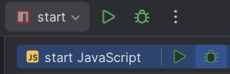

# Random team generator

## Something is wrong with the code
The code is not working as expected:
* The generated teams always have one member more than the maximum team size.
* When you drag a member to another team, the name of the member is not shown in the team list.

## What do you need to do?
* Use debugging techniques to find the problem.
* Think which part of the code could be causing the problem.
* Place breakpoints in the code to see what is happening. Is the content of the variables as you expect?
* Once you found the problem, fix it.


## Set up the project

In the built-in Terminal in Webstorm:
``` Install the dependencies
npm install
```

## How to start the app
In the built-in Terminal in Webstorm:
``` Run the react app
npm run start
```

Then click on the green bug button next to `start Javascript` to start debugging.

